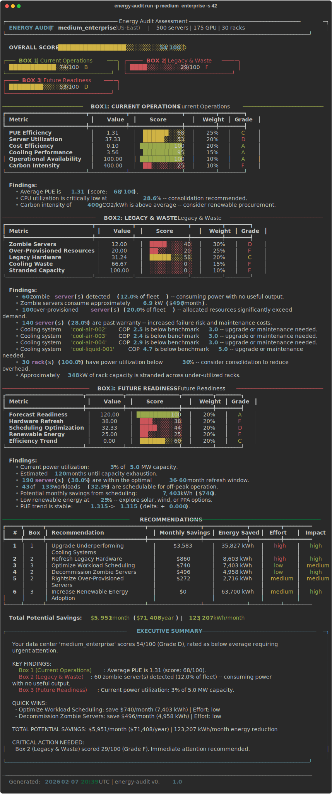
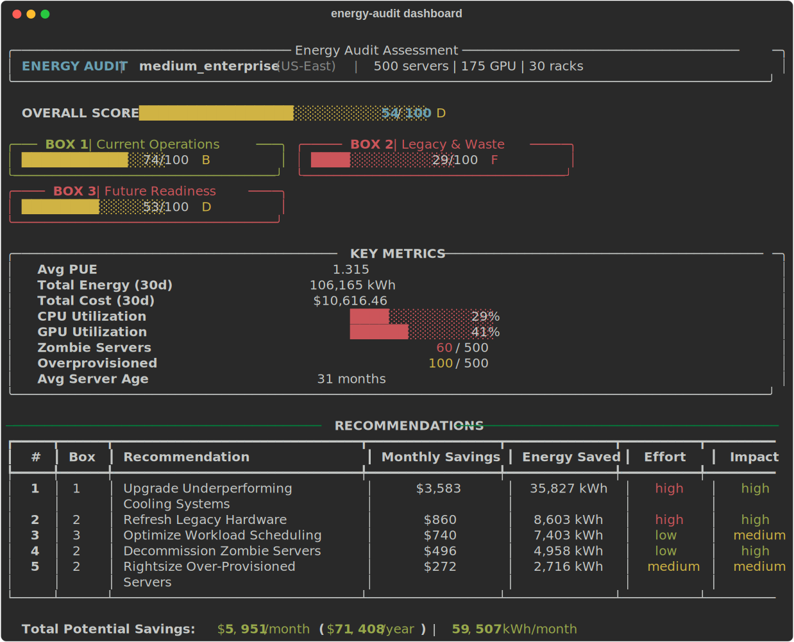
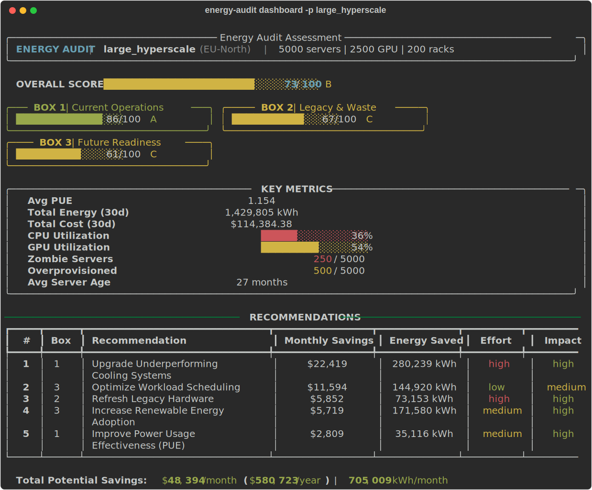
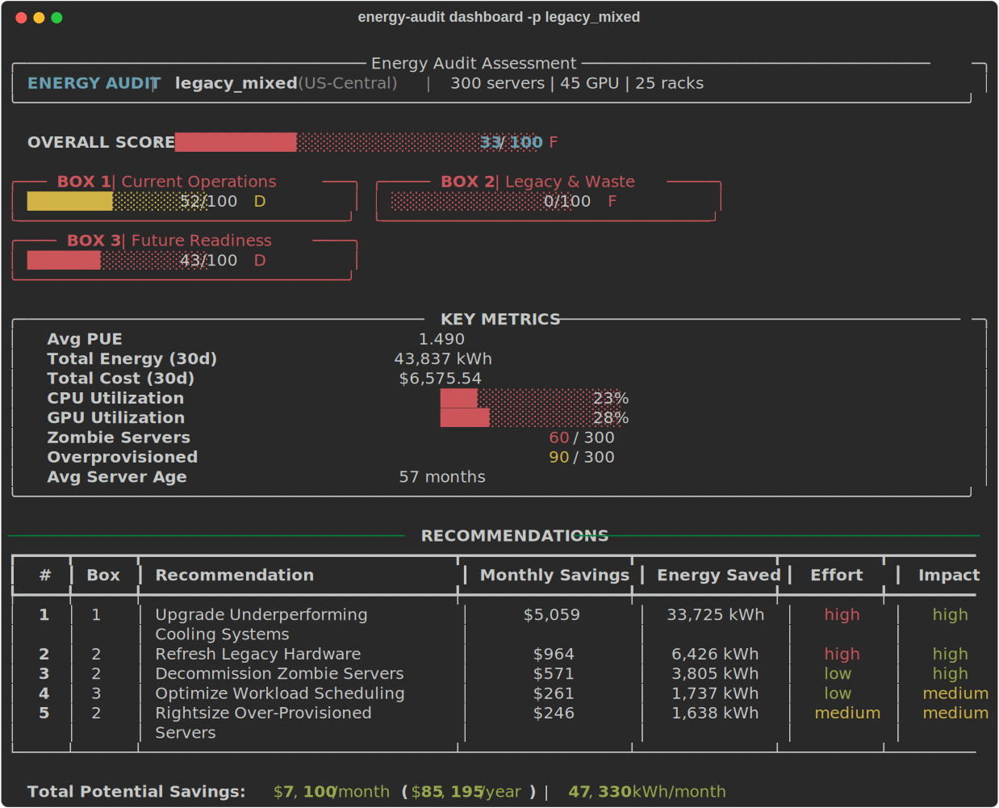
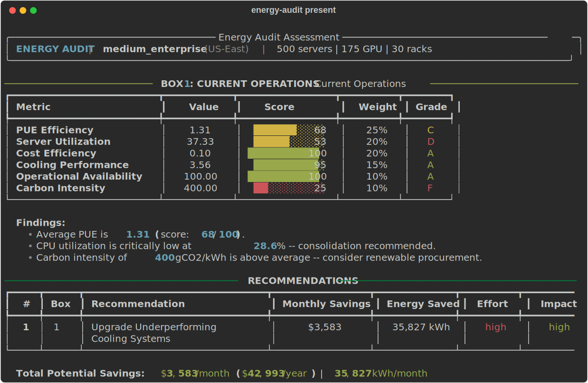
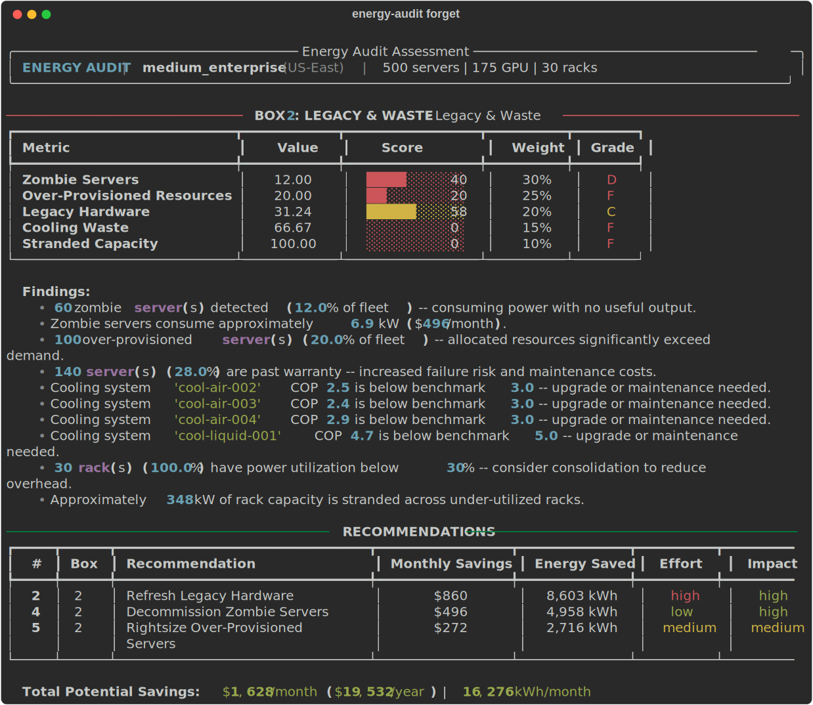
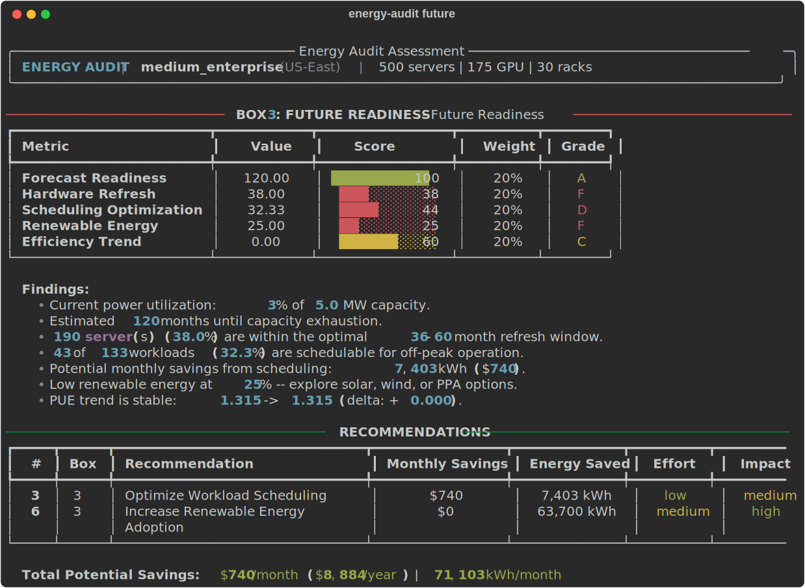

# energy-audit

AI Data Center Energy Assessment Tool — analyze energy consumption, identify waste, and plan for sustainable growth.

## Overview

`energy-audit` evaluates data center energy usage across three assessment pillars:

- **Box 1: Current Operations** — PUE efficiency, server utilization, cost analysis, cooling performance, availability, carbon intensity
- **Box 2: Legacy & Waste** — Zombie servers, over-provisioned resources, legacy hardware, cooling waste, stranded capacity
- **Box 3: Future Readiness** — Capacity forecasting, hardware refresh planning, workload scheduling, renewable energy adoption, efficiency trends

Each pillar produces a weighted score (0–100) with sub-metric breakdowns. The overall facility score combines all three pillars into a single letter grade (A–F).

## Screenshots

### Full Audit Report



### Dashboard View

Compact overview for quick assessment:



### Profile Comparison

**Large Hyperscale (5000 servers, Grade B)**



**Legacy Mixed (300 servers, Grade F)**



### Individual Pillar Detail

<details>
<summary>Box 1: Current Operations</summary>


</details>

<details>
<summary>Box 2: Legacy & Waste</summary>


</details>

<details>
<summary>Box 3: Future Readiness</summary>


</details>

### Sample Reports

- [Sample PDF Report](docs/samples/sample_report.pdf) — 8-page report with embedded charts, scoring tables, recommendations, and methodology appendix
- [Sample JSON Export](docs/samples/sample_results.json) — Full machine-readable audit output

## Features

- Rich terminal output with ASCII gauges, sparklines, and color-coded scoring
- PDF reports with embedded Matplotlib charts (radar, pie, histogram, heatmap, and more)
- JSON export for programmatic consumption
- Four built-in data center profiles (small startup to large hyperscale)
- Seeded random data generation for reproducible results
- Actionable recommendations ranked by savings impact

## Quick Start

```bash
# Install
pip install -e .

# Run a full audit
energy-audit run -p medium_enterprise -s 42

# Export PDF report
energy-audit run -p large_hyperscale -s 42 --export-pdf report.pdf

# Export JSON
energy-audit run -p medium_enterprise -s 42 --export-json results.json
```

## CLI Commands

```bash
energy-audit run       # Full audit across all three pillars
energy-audit present   # Box 1 only (Current Operations)
energy-audit forget    # Box 2 only (Legacy & Waste)
energy-audit future    # Box 3 only (Future Readiness)
energy-audit dashboard # Compact summary view
```

All commands accept `--profile/-p` and `--seed/-s` options.

### Profiles

| Profile | Servers | Description |
|---------|---------|-------------|
| `small_startup` | ~50 | Small cloud-native deployment |
| `medium_enterprise` | ~500 | Mid-size enterprise data center |
| `large_hyperscale` | ~5000 | Hyperscale AI/ML facility |
| `legacy_mixed` | ~300 | Aging facility with mixed hardware |

## Scoring System

### Overall Score = Box 1 (40%) + Box 2 (30%) + Box 3 (30%)

| Grade | Score Range | Meaning |
|-------|-------------|---------|
| A | 85–100 | Excellent |
| B | 70–84 | Good |
| C | 55–69 | Average |
| D | 40–54 | Below Average |
| F | 0–39 | Critical |

Each box contains 5–6 weighted sub-metrics. See `src/energy_audit/scoring/weights.py` for the full breakdown.

## Project Structure

```
src/energy_audit/
├── cli/              # Click CLI commands
├── data/             # Pydantic models, profiles, data generator
│   ├── models.py     # Core data models (Server, DataCenter, BoxScore, etc.)
│   ├── profiles.py   # Data center profile definitions
│   └── generator.py  # Simulated data generator with seeded RNG
├── scoring/          # Weighted scoring engine
│   ├── engine.py     # Master orchestrator
│   ├── weights.py    # All scoring weights (single source of truth)
│   ├── thresholds.py # Industry benchmark thresholds
│   └── box*.py       # Individual box scorers
├── analysis/         # Domain-specific analyzers
├── recommendations/  # Recommendation engine with impact calculation
└── reporting/        # Terminal (Rich), PDF (ReportLab), charts (Matplotlib)
```

## Extending

See [CONTRIBUTING.md](CONTRIBUTING.md) for how to add new profiles, analyzers, and scoring metrics.

## Development

```bash
pip install -e ".[dev]"
pytest tests/ -v
energy-audit run -p medium_enterprise -s 42
```

## License

[MIT](LICENSE)
